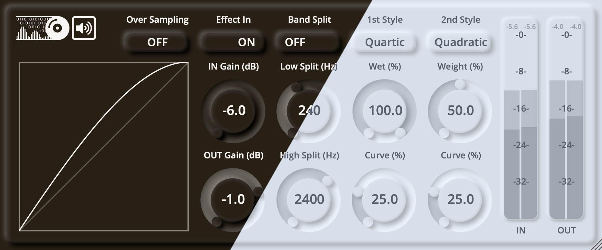

# ZLInflator

ZLInflator is a distortion/saturation plugin to increase loudness.

## Usage

See the wiki for details.

## Download

See the releases for the latest version. 

**Please NOTICE**:
- the installer has **NOT** been notarized/EV certificated on macOS/Windows
- the plugin has **NOT** been fully tested on DAWs

## Build from Source

0. `git clone` this repo

1. [Download CMAKE](https://cmake.org/download/) if you do not have it.

2. Populate the latest JUCE by running `git submodule update --init` in your repository directory.

3. Follow the [JUCE CMake API](https://github.com/juce-framework/JUCE/blob/master/docs/CMake%20API.md) to build the source.

## License

ZLInflator has a GPLv3 license, as found in the [LICENSE](LICENSE) file.

Copyright (c) 2023 - [zsliu98](https://github.com/zsliu98)

JUCE framework from [JUCE](https://github.com/juce-framework/JUCE)

JUCE template from [pamplejuce](https://github.com/sudara/pamplejuce)

Algorithm inspired by [RCJacH](
https://github.com/RCJacH/ReaScripts/blob/master/JSFX/Audio/ZLInflator.jsfx), [lewloiwc, sai'ke and BethHarmon](
https://forum.cockos.com/showthread.php?t=256286)

Font from CMU Open Sans, Font Awesome and MiSans.
